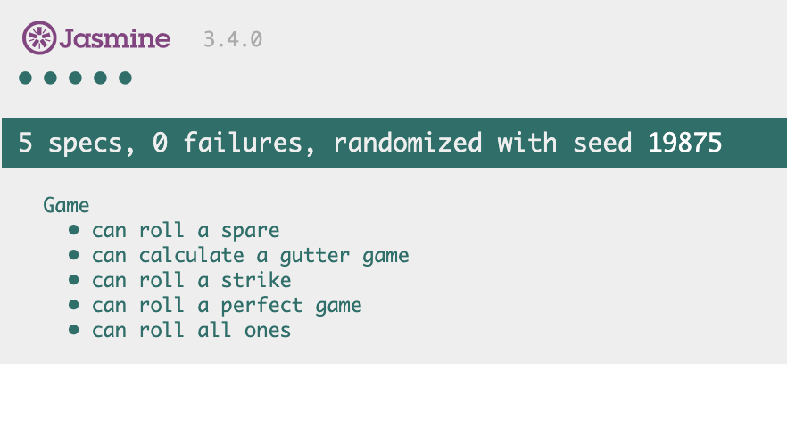
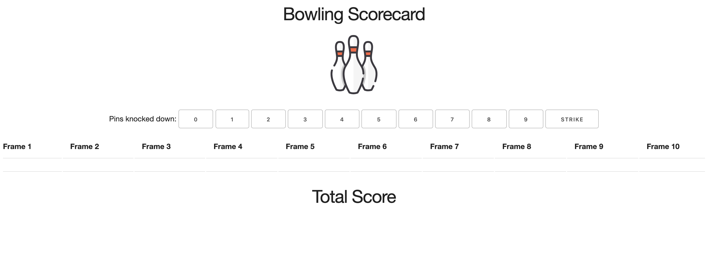

# Bowling Kata

My second attempt at the famous bowling kata. My first attempt was during Week 5 of Makers Academy and my link to that repository is <a href="https://github.com/jordantroberts/bowling-challenge">here</a>.

This time round I followed
<a href="http://www.butunclebob.com/ArticleS.UncleBob.TheBowlingGameKata">Uncle Bob's presentation</a>, in order to explore different ways to solve this kata and practice learning Javascript. The program is finished but I would like to work on the front end.

## To run this program
1. Clone this repo
3. Copy and paste the code from the 'game.js' file into the console.
3. Type `game = new Game();`
4. Input rolls using the following function: `game.roll(x)`, replacing `x` for the number of pins you knocked down.
5. When you have finished your game, type `game.score()` and hit enter in order to see your total score.
6. To see the interface (a work in progress) type `open index.html` from the command line.

## To test this program
1. Clone this repo
2. Type `open SpecRunner.html` from the command line.

The tests all pass:

    

## Rules of Bowling

### Strikes

The player has a strike if he knocks down all 10 pins with the first roll in a frame. The frame ends immediately (since there are no pins left for a second roll). The bonus for that frame is the number of pins knocked down by the next two rolls. That would be the next frame, unless the player rolls another strike.

### Spares

The player has a spare if the knocks down all 10 pins with the two rolls of a frame. The bonus for that frame is the number of pins knocked down by the next roll (first roll of next frame).

### 10th frame

If the player rolls a strike or spare in the 10th frame they can roll the additional balls for the bonus. But they can never roll more than 3 balls in the 10th frame. The additional rolls only count for the bonus not for the regular frame count.

    10, 10, 10 in the 10th frame gives 30 points (10 points for the regular first strike and 20 points for the bonus).
    1, 9, 10 in the 10th frame gives 20 points (10 points for the regular spare and 10 points for the bonus).

### Gutter Game

A Gutter Game is when the player never hits a pin (20 zero scores).

### Perfect Game

A Perfect Game is when the player rolls 12 strikes (10 regular strikes and 2 strikes for the bonus in the 10th frame). The Perfect Game scores 300 points.

## User Interface

Here is a screenshot of the user interface as it currently is:

    

When I get time I would like to fix this so that it properly interacts with my code.

## Acknowledgements
Jordan Roberts - a Makers Academy Challenge, following the steps in Uncle Bob's presentation (linked above)
